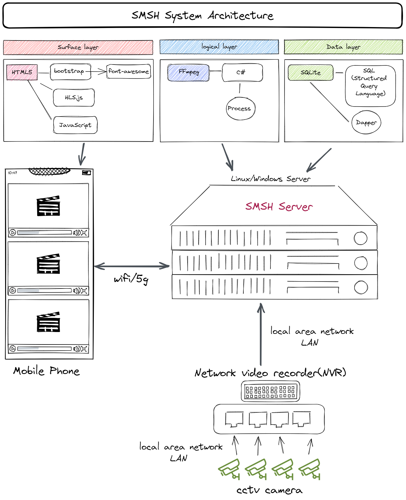

# SMSH - a simple media server for hospital (.NET6 Veriosn)

## System Architecture

## FFMpeg

**Download**  
https://www.ffmpeg.org/download.html  

**FFMPEG Quick Hacks**  
http://www.vsubhash.in/ffmpeg-quick-hacks-book.html  

**push rtsp sample** 
ffmpeg -re -stream_loop -1 -i test.mp4 -vcodec h264 -acodec aac -f rtsp -rtsp_transport tcp rtsp://200.200.200.140:554/test1  
ffmpeg -re -stream_loop -1 -i appletv.mp4 -vcodec h264 -acodec aac -f rtsp -rtsp_transport tcp rtsp://200.200.200.140:554/test2  
ffmpeg -re -stream_loop -1 -i Beautiful.mp4 -vcodec h264 -acodec aac -f rtsp -rtsp_transport tcp rtsp://200.200.200.140:554/test3  
ffmpeg -re -stream_loop -1 -i NewZealand.mp4 -vcodec h264 -acodec aac -f rtsp -rtsp_transport tcp rtsp://200.200.200.140:554/test4  

**rtsp to hls sample**  
ffmpeg.exe -i rtsp://200.200.200.140/test1 -fflags flush_packets -max_delay 2 -hls_flags delete_segments -hls_time 2 -g 30 test-1.m3u8  
ffmpeg.exe -rtsp_transport tcp -i rtsp://200.200.200.140/test2 -fflags flush_packets -max_delay 5 -flags global_header -hls_time 5 -hls_list_size 3 -vcodec copy -y test-2.m3u8  
ffmpeg.exe -i rtsp://200.200.200.140/test3 -fflags flush_packets -max_delay 2 -hls_flags delete_segments -hls_time 2 -g 30 test-3.m3u8  
ffmpeg.exe -i rtsp://200.200.200.140/test4 -fflags flush_packets -max_delay 2 -hls_flags delete_segments -hls_time 2 -g 30 test-4.m3u8  

**Books and other External Resources**  
https://trac.ffmpeg.org/wiki/BooksAndOtherExternalResources

**VLC for Windows**  
https://www.videolan.org/vlc/download-windows.html

**EasyDarwin**  
https://github.com/EasyDarwin/EasyDarwin

**HLS.js**  
https://github.com/video-dev/hls.js/

**Hikvision 海康威视**   
https://www.cnblogs.com/stephenzengx/p/13673981.html  
https://www.cnblogs.com/shuiche/p/12187275.html 

**A Simple c# Wrapper for ffMpeg**  
https://jasonjano.wordpress.com/2010/02/09/a-simple-c-wrapper-for-ffmpeg/  

**SQLite** 
https://www.sqlite.org/index.html

**Dapper - a simple object mapper for .Net** 
https://github.com/DapperLib/Dapper

**.NET 6.0** 
https://visualstudio.microsoft.com/zh-hans/vs/  
https://dotnet.microsoft.com/en-us/download/dotnet/6.0

**Other tools** 

excalidraw 
https://excalidraw.com/

datagrip 
https://www.jetbrains.com/datagrip/

